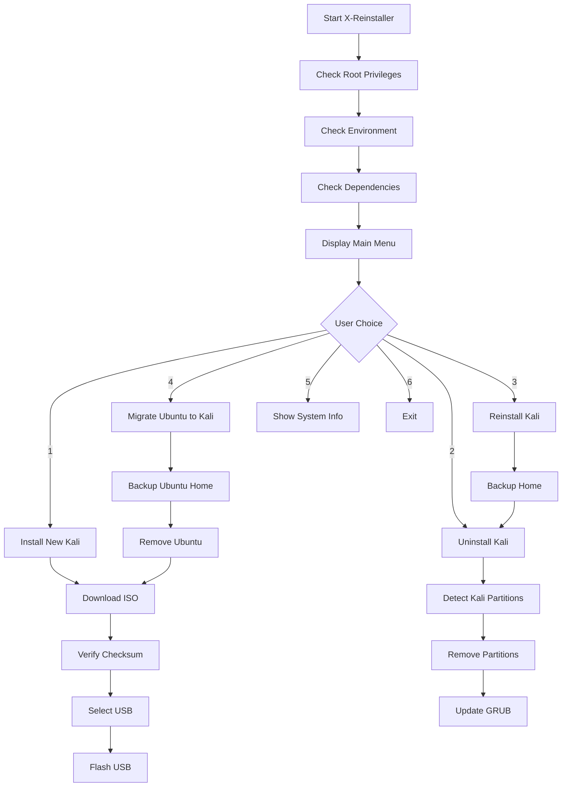

# X-Reinstaller


A powerful bash script for managing Kali Linux installations, including creating bootable USB drives, reinstalling Kali while preserving data, and migrating from Ubuntu to Kali Linux.

## 🚀 Features

- **Install New Kali**: Create bootable USB drives with the latest Kali Linux ISO
- **Uninstall Kali**: Safely remove Kali Linux partitions and boot entries
- **Reinstall Kali**: Backup home directory, uninstall, then reinstall Kali Linux
- **Migrate from Ubuntu**: Complete migration from Ubuntu to Kali Linux with data preservation
- **System Information**: Display detailed system and hardware information
- **User-Friendly Interface**: Interactive menu with colored output and progress indicators
- **Safety Checks**: Built-in verification and confirmation prompts to prevent data loss

## 📋 Requirements

- Linux system (PC/Laptop - not compatible with Termux or UserLAnd)
- Root privileges (sudo access)
- Internet connection for downloading Kali Linux ISO
- USB drive for creating bootable media
- Required packages: `wget`, `sha256sum`, `lsblk`, `dd`, `wipefs`, `grub-mkconfig`, `update-grub`, `rsync`, `awk`, `grep`, `parted`, `lscpu`, `free`

## 💻 Installation

### Quick Start

1. Clone the repository:
```bash
git clone https://github.com/XbibzModder777/X-Reinstaller.git
cd X-Reinstaller
chmod +x reinstall.sh
```

Run the script with root privileges:
```bash
sudo bash reinstall.sh
```
# Workflow 🔥




## 🐛 Troubleshooting

### Common Issues

1. **"No USB devices detected"**
   - Ensure your USB drive is properly connected
   - Try different USB ports
   - Check if the USB drive is recognized by the system with `lsblk`

2. **"Permission denied"**
   - Run the script with `sudo`
   - Ensure your user has sudo privileges

3. **"Command not found"**
   - Install missing dependencies with your package manager
   - For Debian/Ubuntu: `sudo apt update && sudo apt install -y wget sha256sum lsblk dd wipefs grub2-common rsync awk grep parted lscpu free`

4. **"Checksum verification failed"**
   - Check your internet connection
   - Try downloading the ISO again
   - Verify the ISO URL is still valid

### Log Files
The script creates a log file at `/var/log/xreinstaller.log` that contains detailed information about all operations performed.

## 🤝 Contributing

Contributions are welcome! Please feel free to submit issues and pull requests.

### How to Contribute
1. Fork the repository
2. Create your feature branch (`git checkout -b feature/amazing-feature`)
3. Commit your changes (`git commit -m 'Add amazing feature'`)
4. Push to the branch (`git push origin feature/amazing-feature`)
5. Open a Pull Request

## 📄 License

This project is licensed under the GNU General Public License v3.0 - see the [LICENSE](LICENSE) file for details.

## 🙏 Acknowledgments

- Kali Linux team for the amazing distribution
- All contributors who have helped improve this script
- The open-source community for the tools and libraries used

## 📞 Support

- **GitHub Issues**: [Create an issue](https://github.com/XbibzModder777/X-Reinstaller/issues)
- **YouTube**: [@XbibzOfficial](https://youtube.com/@XbibzOfficial)
- **TikTok**: [@xbibzofficiall](https://tiktok.com/@xbibzofficiall)
- **GitHub**: [XbibzOfficial](https://github.com/XbibzOfficial)
- **Telegram**: [Xbibz Rawr](https://t.me/XbibzOfficial)

## 📈 Changelog

### Version 3.4
- Added Ubuntu to Kali migration feature
- Improved USB detection and selection
- Enhanced error handling and logging
- Added system information display
- Improved user interface with colored output
- Added safety checks and confirmation prompts

---

**⚠️ Disclaimer**: This script is provided "as is" without warranty. Use at your own risk. Always backup your data before performing any system modifications.

**Made with ❤️ by Xbibz Official**
